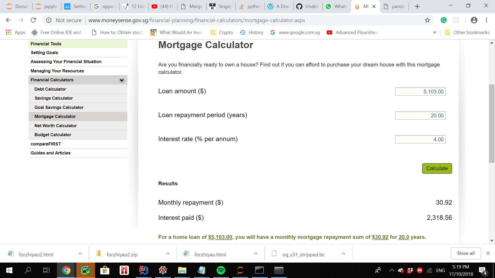

In [3153]:

<pre>%%javascript

Jupyter.keyboard_manager.command_shortcuts.add_shortcut('r', {
    help : 'run all cells',
    help_index : 'zz',
    handler : function (event) {
        IPython.notebook.execute_all_cells();

    }}
);
</pre>

link of data:[URA website](https://www.ura.gov.sg/realEstateIIWeb/transaction/submitSearch.action)

# Threading the property Market in singapore.[¶](#Threading-the-property-Market-in-singapore.) ## Rent or buy?[¶](#Rent-or-buy?) Given a situation where an adult is given the option to buy, assuming he has sufficient for a down payment, should he or she go on to buy a property? Is property truly an asset? Here, we will consider a specific private apartment, ParkView situated in Singapore, with relatively low variables, (no launch of MRT), to fully capture the depreciation of property as an asset, ceteris paribus. The analysis will span a period of 20 years, since its launch in 1998.

## Defining the problem/ Scoping[¶](#Defining-the-problem/-Scoping) To do an anlysis of which is better, it is important that we define the factors we will need, the variables, to make an accurate analysis. Hence, i will be laying them down here. They consist of: 1\. Transaction Prices 2\. CPI 3\. Interest Rates 4\. Rental

In [3154]:

<pre>#import files
import pandas as pd
import seaborn as sns
import numpy as np
import sys
import matplotlib.pyplot as plt
import plotly
import plotly.graph_objs as go

plotly.tools.set_credentials_file(username='s9600820a', api_key='5CkH8mTNtfDR2N6LZvmG')
</pre>

In [3155]:

<pre>CPIdf = pd.read_csv("CPI123.csv")
ax = sns.barplot(x="year", y="value", data=CPIdf)
plt.show()
</pre>

![](data:image/png;base64,iVBORw0KGgoAAAANSUhEUgAAAYYAAAEKCAYAAAAW8vJGAAAABHNCSVQICAgIfAhkiAAAAAlwSFlz AAALEgAACxIB0t1+/AAAADl0RVh0U29mdHdhcmUAbWF0cGxvdGxpYiB2ZXJzaW9uIDIuMS4wLCBo dHRwOi8vbWF0cGxvdGxpYi5vcmcvpW3flQAAGbxJREFUeJzt3Xu0XXV16PHvJIhWQXzkgJgEQiuI KQNBD4jVITh4lFBLBhWVjCJVgdx6QaV6veKoFxVrW2kvpQ4jkAoiiDzkGTEQrhR8IVwCaq4hJoaA cuSRgDzkTei8f/zWMXsdzmOvzVk5J+H7GeOMs9dr7rnWXnvN9VuvHZmJJEmDNpvoBCRJk4uFQZJU Y2GQJNVYGCRJNRYGSVKNhUGSVGNhkCTVWBgkSTUWBklSzeZtBY6Is4B3AWsyc9dRxtsTuBF4X2Ze PFbcqVOn5syZM8ctT0l6Ibjlllvuz8y+bsZtrTAAZwNfAc4ZaYSImAJ8CVjcbdCZM2eyZMmS552c JL2QRMSvux23tUNJmfkD4HdjjPYR4BJgTVt5SJKambBzDBExDTgUOH2icpAkPddEnnw+FfhUZj47 1ogRMS8ilkTEkrVr126A1CTphavNcwxj6QcuiAiAqcDBEbEuMy8fOmJmLgAWAPT39/uccElq0YQV hszccfB1RJwNXDlcUZAkbVhtXq56PrAvMDUiBoDPAi8CyEzPK0jSJNVaYcjMuQ3G/UBbeUiSmvHO Z0lSjYVBklQzkVclSdIG8dOvNb+Hdo+jt2khk42DhUGSxnDPyb/tabrt/ue0cc1jzVeuaTzNNscd 2HgaC4OkSe2qC+9vPM3s901tIZPn575Tb+lpum2Pf/M4ZzI2zzFIkmosDJKkGguDJKnGwiBJqvHk s6TWzL/svp6mO/bQbcc5EzVhi0GSVGNhkCTVWBgkSTUWBklSjYVBklRjYZAk1VgYJEk13scgaVjv u3RVT9Nd+FevG+dMtKHZYpAk1VgYJEk1FgZJUo2FQZJU01phiIizImJNRPxihOF/HRFLq78bIuKN beUiSepemy2Gs4GDRhl+B7BPZu4GfAFY0GIukqQutXa5amb+ICJmjjL8ho7OG4HpbeUiSereZDnH cBRw1UgDI2JeRCyJiCVr167dgGlJ0gvPhBeGiHgnpTB8aqRxMnNBZvZnZn9fX9+GS06SXoAm9M7n iNgN+BowOzMfmMhcpE3NoZf8qPE0l7377S1koo3NhLUYImJ74FLg/Zm5cqLykCTVtdZiiIjzgX2B qRExAHwWeBFAZp4OnAi8GvhqRACsy8z+tvKRJHWnzauS5o4x/Gjg6LbeX5LUmwk/+SxJmlx87LY0 CR1y8XcaT7PwsL9sIRO9EFkYpHH2rovP62m6Kw/763HOROqNh5IkSTUWBklSjYVBklRjYZAk1VgY JEk1FgZJUo2FQZJUY2GQJNVYGCRJNRYGSVKNj8SQhviLS09rPM13/+rDLWQiTQxbDJKkGguDJKnG Q0napBx82T80nmbRoZ9pIRNp42WLQZJUY4tBk8bsK97deJqr5lzSQibSC5uFQePicxf9eW/TvXfx OGci6fnyUJIkqaa1FkNEnAW8C1iTmbsOMzyAfwcOBh4HPpCZt7aVz2R1/X/8ReNp9j3mu+Oexxnn Nt/j/2/vd29f2hS1eSjpbOArwDkjDJ8N7FT9vQU4rfqvhi7++kGNpznsg1e3kImkTUFrhSEzfxAR M0cZZQ5wTmYmcGNEvCIitsvMe9rKabz9cv6cnqbb5dgrxjkTSRo/E3mOYRpwV0f3QNVPkjSBJvKq pBimXw47YsQ8YB7A9ttvD8Da077Z+A37PnxErfve05rfDPWaD3szlKRN20S2GAaAGR3d04G7hxsx MxdkZn9m9vf19W2Q5CTphWoiC8NC4Mgo9gYe3pjOL0jSpqrNy1XPB/YFpkbEAPBZ4EUAmXk6sIhy qeoqyuWqH2wrF0lS99q8KmnuGMMTOLat95ck9cY7nyVJNRYGSVKNhUGSVGNhkCTVWBgkSTUWBklS jYVBklRjYZAk1VgYJEk1FgZJUo2FQZJUY2GQJNVYGCRJNRYGSVKNhUGSVGNhkCTVWBgkSTUWBklS jYVBklRjYZAk1VgYJEk1FgZJUk2rhSEiDoqIFRGxKiJOGGb49hFxXUT8NCKWRsTBbeYjSRpba4Uh IqYA84HZwCxgbkTMGjLaZ4CLMnMP4HDgq23lI0nqTpsthr2AVZm5OjOfBi4A5gwZJ4GXV6+3Bu5u MR9JUhc2bzH2NOCuju4B4C1DxvkccE1EfAR4GbB/i/lIkrrQZoshhumXQ7rnAmdn5nTgYODciHhO ThExLyKWRMSStWvXtpCqJGlQm4VhAJjR0T2d5x4qOgq4CCAzfwK8BJg6NFBmLsjM/szs7+vrayld SRJ0URgiYtuIODMirqq6Z0XEUV3EvhnYKSJ2jIgtKCeXFw4Z5zfAflXcN1AKg00CSZpA3bQYzgYW A6+tulcCx481UWauA46rpl1OufpoWUScFBGHVKN9AjgmIn4OnA98IDOHHm6SJG1A3Zx8npqZF0XE p6Fs8CPi2W6CZ+YiYNGQfid2vL4NeFuDfCVJLeumxfBYRLya6sRxROwNPNxqVpKkCdNNi+HjlHMD fxIRPwb6gMNazUqSNGHGLAyZeWtE7AO8nnIJ6orMfKb1zCRJE2LMwhARRw7p9aaIIDPPaSknSdIE 6uZQ0p4dr19Cubz0VsDCIEmboG4OJX2kszsitgbObS0jSdKE6uXO58eBncY7EUnS5NDNOYbvsP4Z R5tRHqF9UZtJSZImTjfnGP614/U64NeZOdBSPpKkCdbNOYbvb4hEJEmTw4iFISJ+z3Mfkw3lXobM zJcPM0yStJEbsTBk5lYbMhFJ0uTQ9S+4RcQ2lPsYAMjM37SSkSRpQnXzewyHRMSvgDuA7wN3Ale1 nJckaYJ0cx/DF4C9gZWZuSPlzucft5qVJGnCdFMYnsnMB4DNImKzzLwO2L3lvCRJE6SbcwwPRcSW wA+B8yJiDeV+BknSJqibFsMPgFcAHwOuBm4H/rLNpCRJE6ebwhCU322+HtgSuLA6tCRJ2gSNWRgy 8/OZ+afAscBrge9HxPdaz0ySNCGaPF11DXAv8ACwTTvpSJImWjf3MXw4Iq4HrgWmAsdk5m7dBI+I gyJiRUSsiogTRhjnvRFxW0Qsi4hvNUlekjT+urkqaQfg+Mz8WZPAETEFmA8cAAwAN0fEwsy8rWOc nYBPA2/LzAeru6slSROom6erDrun34W9gFWZuRogIi4A5gC3dYxzDDA/Mx+s3mtNj+8lSRonvfyC W7emAXd1dA9U/TrtDOwcET+OiBsj4qAW85EkdaHrh+j1IIbpN/Qx3ptTfiZ0X2A68MOI2DUzH6oF ipgHzAPYfvvtxz9TSdIftNliGABmdHRPB+4eZpwrMvOZzLwDWMEwvyedmQsysz8z+/v6+lpLWJLU bmG4GdgpInaMiC2Aw4GFQ8a5HHgnQERMpRxaWt1iTpKkMbRWGDJzHXAc5a7p5cBFmbksIk6KiEOq 0RYDD0TEbcB1wCe9q1qSJlab5xjIzEXAoiH9Tux4ncDHqz9J0iTQ5qEkSdJGyMIgSaqxMEiSaiwM kqQaC4MkqcbCIEmqsTBIkmosDJKkGguDJKnGwiBJqrEwSJJqLAySpBoLgySpxsIgSaqxMEiSaiwM kqQaC4MkqcbCIEmqsTBIkmosDJKkGguDJKnGwiBJqmm1METEQRGxIiJWRcQJo4x3WERkRPS3mY8k aWytFYaImALMB2YDs4C5ETFrmPG2Aj4K3NRWLpKk7rXZYtgLWJWZqzPzaeACYM4w430BOBl4ssVc JEldarMwTAPu6ugeqPr9QUTsAczIzCtbzEOS1ECbhSGG6Zd/GBixGfBvwCfGDBQxLyKWRMSStWvX jmOKkqSh2iwMA8CMju7pwN0d3VsBuwLXR8SdwN7AwuFOQGfmgszsz8z+vr6+FlOWJLVZGG4GdoqI HSNiC+BwYOHgwMx8ODOnZubMzJwJ3AgckplLWsxJkjSG1gpDZq4DjgMWA8uBizJzWUScFBGHtPW+ kqTnZ/M2g2fmImDRkH4njjDuvm3mIknqjnc+S5JqLAySpBoLgySpxsIgSaqxMEiSaiwMkqQaC4Mk qcbCIEmqsTBIkmosDJKkGguDJKnGwiBJqrEwSJJqLAySpBoLgySpxsIgSaqxMEiSaiwMkqQaC4Mk qcbCIEmqsTBIkmosDJKkmlYLQ0QcFBErImJVRJwwzPCPR8RtEbE0Iq6NiB3azEeSNLbWCkNETAHm A7OBWcDciJg1ZLSfAv2ZuRtwMXByW/lIkrrTZothL2BVZq7OzKeBC4A5nSNk5nWZ+XjVeSMwvcV8 JEldaLMwTAPu6ugeqPqN5CjgquEGRMS8iFgSEUvWrl07jilKkoZqszDEMP1y2BEjjgD6gX8Zbnhm LsjM/szs7+vrG8cUJUlDbd5i7AFgRkf3dODuoSNFxP7A3wP7ZOZTLeYjSepCmy2Gm4GdImLHiNgC OBxY2DlCROwBnAEckplrWsxFktSl1gpDZq4DjgMWA8uBizJzWUScFBGHVKP9C7Al8O2I+FlELBwh nCRpA2nzUBKZuQhYNKTfiR2v92/z/SVJzXnnsySpxsIgSaqxMEiSaiwMkqQaC4MkqcbCIEmqsTBI kmosDJKkGguDJKnGwiBJqrEwSJJqLAySpBoLgySpxsIgSaqxMEiSaiwMkqQaC4MkqcbCIEmqsTBI kmosDJKkGguDJKmm1cIQEQdFxIqIWBURJwwz/MURcWE1/KaImNlmPpKksbVWGCJiCjAfmA3MAuZG xKwhox0FPJiZrwP+DfhSW/lIkrrTZothL2BVZq7OzKeBC4A5Q8aZA3yjen0xsF9ERIs5SZLG0GZh mAbc1dE9UPUbdpzMXAc8DLy6xZwkSWOIzGwncMR7gD/PzKOr7vcDe2XmRzrGWVaNM1B1316N88CQ WPOAeVXn64EVY7z9VOD+55H+851+U4oxGXIYjxiTIYfJEmMy5DBZYkyGHDZUjB0ys6+bQJs/z0RG MwDM6OieDtw9wjgDEbE5sDXwu6GBMnMBsKDbN46IJZnZ3zjjcZp+U4oxGXIYjxiTIYfJEmMy5DBZ YkyGHCZTjEFtHkq6GdgpInaMiC2Aw4GFQ8ZZCPxN9fow4D+zrSaMJKkrrbUYMnNdRBwHLAamAGdl 5rKIOAlYkpkLgTOBcyNiFaWlcHhb+UiSutPmoSQycxGwaEi/EztePwm8p4W37vqwU0vTb0oxJkMO 4xFjMuQwWWJMhhwmS4zJkMNkigG0ePJZkrRx8pEYkqS6zJz0f8BZwBrgFx393gj8BPh/wHeAl1f9 twC+XvX/ObBvR4yHgSeBpcDVwD7dxqBcPXUd5UqqJ4F7gJOBVwH/B/hV9f+VVYwAvgysqt7vTR0x 7gaeAtZSTr73EuNR4NnBZdIgxuxq+tXA49V8LAU+1DCHG4Anqr97gL/tcT6WV38PAV/pMUZWeQxQ LmhouiyWAyuBX1avfwn8sEEOP6WsE4M5PAkc0cN8PFBNe281Ti/L4n7Wr5/vGyXGLpR1/yngfwz5 PH4N3FfF/3w301f9BmM8BKwD7hlj3Rwpxg3AY1X/e4CP9RDj+9XnMbgsPt/jslgGHF99xot7WBZP VzkMAEt6mI/rKJfnP1x9JsuBA7uNUfV/PfCzjr9HgONH3eZO9Ea/y8LwDsrK31kYbgb2qV5/CPhC 9fpY4OvV622AWygto3dSTnAvr4adDPy2QYzXVjF+A8ykbEgup9zRfUI17gnAl6rXBwNXUb7EewM3 AdtRisxqYHvKF+8u4N8bxngTsB/wXkqBmFXNTzcxbq2m3xnYvZqPfao4n2uQw17Ai4GtqhX0t5RH oDSaj2r4V6uV9bwG89G5LB6t8ljZy7Kohv2Q8uWdRXk8y//qYT62qj7Th4BTGs7HB4AfUy7ZXkn5 Ap/fMMZHKRuKV1SfyS+AU0eIsQ2wJ/BFysZwcFlOoayfd1B2vtYAp4w1fdVvMMY7gLdTNlCjfR4j xTiwijO4bt1JuVClSYw3AVuyfr1YCpzbZFl0fKZrgCurz7ZpDncCOzD2ujlajG9Qtkkrq89kpO3F c2IMsy2dQtnx2GGjLwzVDM2kXhgeYf05khnAbdXr+cARHeNdS9mIvYiyR7aC8oU6nbJH0STGnsD3 qn5XAP8MPAhs1/FBrqhenwHM7Yixoho+FzijI8aVlBZE1zE6uvetPuQDOoc1jHFFNf2TwJ81nb7q t4jy5VnVNAfgzZTiemuVS+P5AB4dMi+NYlC+sD/qdfohy+Jn1frSNIe3UnZA/qhaJ1ZSNs5NYnwS +EzHsriKEdatjmk/R33v8q2UPePBZbEW+Mdupx/yfX1ktOU5VoyO+biBsgPVa4wrKQXm101jUO6/ Wlst20d7mP5Oyo1no65bo3weL6/Wg+g1xpBhBwI/Hm5Y59/GfI7hF8Ah1ev3sP5mup8DcyJi84jY kbLhmZGZzwCfAV5H+bLMojQPu45B2fDtEhFvB/YA3gBsmZn3AFT/t6lijPRIkGnAXdWTZPegbEhe 2TDGoNdQ9jBvArZtGqMjh3WUwnljw+lnRMRy4CDKAxCnNskhIjYD/jdlD2gHSpFrPB/ASyJiaZXH 1B5i7EzZuz0A+NcqlzUNcxhcnrtQdjoa5ZCZP6EcNriP0iK4gubrxc+B2RGxC2Wd3WWUGCOZRtnZ 2YOyXr2UsnHqdvpB04GXMPq6OapqefZTvntbNY0REVMi4jbK8rwS2LqHPBZQvh/LgBf3MH0C11MO W76B5svijymF6dtVjCN6iNHpcEpLdFQbc2H4EHBsRNxCae49XfU/i/XH806l7G2si4gXURbq7ZTD QkuB/9skRmY+CPwdZY/qCUqhyBHyG+5hgFn13wK4hHLs8qlR5nGkGETElpTjpssy85GmMarpL6Hs XZwOPJ6Z/9UkB8oG5HHgGMrx7JEegDhSjP8OfI9ybuFbwDMjTD9WHrtU0x4P/BMjr9cjxdiS0vr6 BGWDuhnl0E7XOVTL8wrK53n5CO8/YoyIeB2wK2X9PIJyKGZKkxiZeQ1led5KaR3fwMjr50j+CNif cgx6cL1qFKNaFqcB946xbo4V4zJKS/ZjvcSgzMsTwJGUw6aNtncRcRilMB1LWc97cQBlnZhHeZr0 SJ/pSDanHE76U8pG/SFKwW2sutH4EEqRGdVGWxgy85eZeWBmvplSAW+v+q/LzL/LzN0zcw7rj7fu Xk36dJY21UXAzk1iVMXlaMrx58FnNj0aEdsBVP/XVO8z0iNB7gE+CJyXmZdW/R9sEqPK4xLKRuDe ath9DWKsqaa/GDiO0pK6u8cczsvMMyl7VE2XxZ8Bfw/sSDnEdiTwbA95zK/yOI2yd/b7hsviOOCO zDwty8McH6BsmJsui9XAhVXrtMnncTfwbuBPgHMz81uUw0BP9LAs9qYcTnojpYD8boQYz1FNfyxw f7VuQtkg/r6b6TtiXEIpjoNFYaRlMVqMSykb9vlVLr3EGFw/v0lZL55suCxOpuzEnUI53DklIi5u mMPgunk2pdCN9JmO5F7KTs9/VMvhYsqObpMYg2YDt2bmfWONuNEWhojYpvq/GWXDdnrV/dKIeFn1 +gDKnv5tlJOjO7G+Yh9AOf7XVQzK1QBnAndm5ikR8UrKHu+lrH+sx99Q9hqhXB1zZBR7U64quBd4 F6Vp/vUqxoGUFbhJjDOrfDor/8IGMb5IKWr7A+dk5rcbTn8vpZCu7FgWbwOuaRhjHeV8y6soJ/3O obTWmsQ4tyOPqVUeixsui5uAxyJi8AFj9wOv7OHz2I71zfSmy/Ngysn8L1cblH0o5z2axDiLUuBO iYjdgN0oG7ThYtRERFTzcROwRax/lE2yfg91xOmHxBj8rgwaaVmMFmM6cHVmntJjjG8Cq6tlMdgK +mE3MTpyWJiZr8jMmZS99TsoRxG6zeEblJ8eOKXanhxIuVqqyXz8I+Wime9WvfcDbus2xhBz6eIw ErBxnHyuZuYeSuUcoDTJPkY5QbeSchJ48CTyTMpGbzllj3qHjhgPU1b0pynH9j/dbQzKHmRSmnJP Vn//THlM+LWUVsm1wKuqGEHZW7idctlrf0eMuyjNy6coeyO9xHiMsmH9L8qG7LAuYxxVTf8b1l/m OTjspoY5PNHx9+Ue52Np9Vn8hnLJcC8xOvM4tUGMwWWxlHJY8AnKzsL5wH82zGE569erg3ucj8HL VZ+k7HD0EmNw+scoLaGRYryG8l16hLJOr+lYFrez/jLPf+hy+gHKhm/wO/JM9fp+ytVSTWN0fq63 Uw5VNo3RuV6c2+OyGLzE81OUHY7nk8M3GuTQGWMlpeX2BOVy1D9uEGPwEvyXUtavrbvZ5nrnsySp ZqM9lCRJaoeFQZJUY2GQJNVYGCRJNRYGSVKNhUGSVGNhkCZARDR9NIK0wVgYpDFExBci4mMd3V+M iI9GxCcj4uaIWBoRn+8YfnlE3BIRyyJiXkf/RyPipIi4ifIUU2lSsjBIYzuT6hEE1eNTDqc8BXUn yuPYdwfeHBHvqMb/UPX8rX7goxHx6qr/yyiPjn9LZv5oQ86A1MTmE52ANNll5p0R8UBE7AFsS3lc +56URxb8tBptS0qh+AGlGBxa9Z9R9X+A8ot7l2zI3KVeWBik7nyN8iju11AeVrcf8E+ZeUbnSBGx L+WBbW/NzMcj4nrWP4Tuycx8dkMlLPXKQ0lSdy6j/BDQnpSHqS0GPhTldwOIiGnVE3+3Bh6sisIu lMdgSxsVWwxSFzLz6Yi4Dnio2uu/JiLeAPykPB2ZRyk/sHM18LdRflFuBdWv4kkbE5+uKnWhOul8 K/CezPzVROcjtclDSdIYImIW5fcarrUo6IXAFoMkqcYWgySpxsIgSaqxMEiSaiwMkqQaC4MkqcbC IEmq+f8WNk+wltyskQAAAABJRU5ErkJggg== )

The above graph is the Consumer price index over the years, pegged to 1998\. Next, we look at the rental for the past 20 years. Unfortunately, I was only able to get my hands on the average over the span of 20 years, and not individual data. 

In [3156]:

<pre>rentPerMonthPSM = 21.7
</pre>

Now we will be looking at the raw Data we have.(Tranactions in ParkView)

In [3157]:

<pre>RawPVdf = pd.read_csv("RawparkviewTransactions.csv")
print(list(RawPVdf))# headers
RawPVdf=RawPVdf.drop(['Address','No. of Units'],axis =1)
RawPVdf.iloc[np.r_[0:2, -2:0]]
</pre>

<pre>['Project Name', 'Address', 'No. of Units', 'Area (sqm)', 'Type of Area', 'Transacted Price ($)', 'Nett Price($)', 'Unit Price ($ psm)', 'Unit Price ($ psf)', 'Sale Date', 'Property Type', 'Tenure', 'Completion Date', 'Type of Sale', 'Purchaser Address Indicator', 'Postal District', 'Postal Sector', 'Postal Code', 'Planning Region', 'Planning Area']
</pre>

Out[3157]:

<table border="1" class="dataframe">

<thead>

<tr style="text-align: right;">

<th></th>

<th>Project Name</th>

<th>Area (sqm)</th>

<th>Type of Area</th>

<th>Transacted Price ($)</th>

<th>Nett Price($)</th>

<th>Unit Price ($ psm)</th>

<th>Unit Price ($ psf)</th>

<th>Sale Date</th>

<th>Property Type</th>

<th>Tenure</th>

<th>Completion Date</th>

<th>Type of Sale</th>

<th>Purchaser Address Indicator</th>

<th>Postal District</th>

<th>Postal Sector</th>

<th>Postal Code</th>

<th>Planning Region</th>

<th>Planning Area</th>

</tr>

</thead>

<tbody>

<tr>

<th>0</th>

<td>PARKVIEW APARTMENTS</td>

<td>104</td>

<td>Strata</td>

<td>815000</td>

<td>-</td>

<td>7837</td>

<td>728</td>

<td>26-Sep-18</td>

<td>Apartment</td>

<td>99 Yrs From 01/05/1994</td>

<td>1998</td>

<td>Resale</td>

<td>HDB</td>

<td>23</td>

<td>65</td>

<td>658882</td>

<td>West Region</td>

<td>Bukit Batok</td>

</tr>

<tr>

<th>1</th>

<td>PARKVIEW APARTMENTS</td>

<td>87</td>

<td>Strata</td>

<td>728000</td>

<td>-</td>

<td>8368</td>

<td>777</td>

<td>17-Sep-18</td>

<td>Apartment</td>

<td>99 Yrs From 01/05/1994</td>

<td>1998</td>

<td>Resale</td>

<td>HDB</td>

<td>23</td>

<td>65</td>

<td>658882</td>

<td>West Region</td>

<td>Bukit Batok</td>

</tr>

<tr>

<th>607</th>

<td>PARKVIEW APARTMENTS</td>

<td>104</td>

<td>Strata</td>

<td>465000</td>

<td>-</td>

<td>4471</td>

<td>415</td>

<td>Nov-98</td>

<td>Apartment</td>

<td>99 Yrs From 01/05/1994</td>

<td>1998</td>

<td>Sub Sale</td>

<td>Private</td>

<td>23</td>

<td>65</td>

<td>658881</td>

<td>West Region</td>

<td>Bukit Batok</td>

</tr>

<tr>

<th>608</th>

<td>PARKVIEW APARTMENTS</td>

<td>104</td>

<td>Strata</td>

<td>505000</td>

<td>-</td>

<td>4856</td>

<td>451</td>

<td>6-Oct-98</td>

<td>Apartment</td>

<td>99 Yrs From 01/05/1994</td>

<td>1998</td>

<td>Sub Sale</td>

<td>HDB</td>

<td>23</td>

<td>65</td>

<td>658882</td>

<td>West Region</td>

<td>Bukit Batok</td>

</tr>

</tbody>

</table>

As you can see, the data contains accurate transactions, but we will be removing majority of the columns, keeping price, getting the average transaction price per year, and adjusting with CPI.

In [3158]:

<pre>PVdf=RawPVdf.loc[:, ['Unit Price ($ psm)','Sale Date','Purchaser Address Indicator' ]]
PVdf.iloc[np.r_[0:2, -2:0]]
</pre>

Out[3158]:

<table border="1" class="dataframe">

<thead>

<tr style="text-align: right;">

<th></th>

<th>Unit Price ($ psm)</th>

<th>Sale Date</th>

<th>Purchaser Address Indicator</th>

</tr>

</thead>

<tbody>

<tr>

<th>0</th>

<td>7837</td>

<td>26-Sep-18</td>

<td>HDB</td>

</tr>

<tr>

<th>1</th>

<td>8368</td>

<td>17-Sep-18</td>

<td>HDB</td>

</tr>

<tr>

<th>607</th>

<td>4471</td>

<td>Nov-98</td>

<td>Private</td>

</tr>

<tr>

<th>608</th>

<td>4856</td>

<td>6-Oct-98</td>

<td>HDB</td>

</tr>

</tbody>

</table>

In [3159]:

<pre>#PVdf['year']=PVdf['Sale Date'].dt.strftime('Y')
PVdf['year']=PVdf['Sale Date'].str.slice(-2)
</pre>

In [3160]:

<pre>#create pivot ttable just for fun
impute_grps = PVdf.pivot_table(index='year', columns='Purchaser Address Indicator', aggfunc='count', fill_value=0)
impute_grps["Sale Date"]
</pre>

Out[3160]:

<table border="1" class="dataframe">

<thead>

<tr style="text-align: right;">

<th>Purchaser Address Indicator</th>

<th>HDB</th>

<th>N.A</th>

<th>Private</th>

</tr>

<tr>

<th>year</th>

<th></th>

<th></th>

<th></th>

</tr>

</thead>

<tbody>

<tr>

<th>00</th>

<td>7</td>

<td>0</td>

<td>5</td>

</tr>

<tr>

<th>01</th>

<td>10</td>

<td>0</td>

<td>7</td>

</tr>

<tr>

<th>02</th>

<td>8</td>

<td>0</td>

<td>7</td>

</tr>

<tr>

<th>03</th>

<td>7</td>

<td>0</td>

<td>7</td>

</tr>

<tr>

<th>04</th>

<td>12</td>

<td>0</td>

<td>10</td>

</tr>

<tr>

<th>05</th>

<td>13</td>

<td>0</td>

<td>9</td>

</tr>

<tr>

<th>06</th>

<td>17</td>

<td>0</td>

<td>14</td>

</tr>

<tr>

<th>07</th>

<td>26</td>

<td>0</td>

<td>34</td>

</tr>

<tr>

<th>08</th>

<td>12</td>

<td>0</td>

<td>17</td>

</tr>

<tr>

<th>09</th>

<td>29</td>

<td>0</td>

<td>29</td>

</tr>

<tr>

<th>10</th>

<td>41</td>

<td>0</td>

<td>25</td>

</tr>

<tr>

<th>11</th>

<td>35</td>

<td>0</td>

<td>19</td>

</tr>

<tr>

<th>12</th>

<td>23</td>

<td>0</td>

<td>17</td>

</tr>

<tr>

<th>13</th>

<td>12</td>

<td>0</td>

<td>13</td>

</tr>

<tr>

<th>14</th>

<td>4</td>

<td>0</td>

<td>8</td>

</tr>

<tr>

<th>15</th>

<td>8</td>

<td>0</td>

<td>8</td>

</tr>

<tr>

<th>16</th>

<td>16</td>

<td>0</td>

<td>7</td>

</tr>

<tr>

<th>17</th>

<td>16</td>

<td>0</td>

<td>9</td>

</tr>

<tr>

<th>18</th>

<td>12</td>

<td>0</td>

<td>11</td>

</tr>

<tr>

<th>98</th>

<td>2</td>

<td>0</td>

<td>2</td>

</tr>

<tr>

<th>99</th>

<td>26</td>

<td>5</td>

<td>10</td>

</tr>

</tbody>

</table>

this is just for my curiosity on the demographics of people who purchase property. Back to work

In [3161]:

<pre>def completeDate(year):
    year=int(year)
    if year<50:
        return 2000+year
    else:
        return 1900+year
</pre>

In [3162]:

<pre>PVdf['year']=PVdf.year.apply(completeDate)
PVdf=PVdf.drop(['Sale Date','Purchaser Address Indicator'],axis =1)
PVdf.iloc[np.r_[0:2, -2:0]]
</pre>

Out[3162]:

<table border="1" class="dataframe">

<thead>

<tr style="text-align: right;">

<th></th>

<th>Unit Price ($ psm)</th>

<th>year</th>

</tr>

</thead>

<tbody>

<tr>

<th>0</th>

<td>7837</td>

<td>2018</td>

</tr>

<tr>

<th>1</th>

<td>8368</td>

<td>2018</td>

</tr>

<tr>

<th>607</th>

<td>4471</td>

<td>1998</td>

</tr>

<tr>

<th>608</th>

<td>4856</td>

<td>1998</td>

</tr>

</tbody>

</table>

In [3163]:

<pre>PVdf.columns = ['UnitPrice','year']
PVdf=PVdf.groupby(['year']).UnitPrice.agg(['count','mean'])
PVdf=PVdf.reset_index()
</pre>

So here, i faced an issue which took sometime to fix. What happend was that there were 2018 transactions, but not infaltion for 2018\. Hence, i had to take out 2018 transactions. Or asssume zero inflation.

In [3164]:

<pre>var = CPIdf.at[19,'value']
var
CPIdf.append(pd.Series([0,2018,var], index=CPIdf.columns) , ignore_index=True)
CPIdf = CPIdf.drop(['Unnamed: 0'],axis =1)
PVdf =pd.merge(PVdf, CPIdf,on='year')
PVdf
</pre>

Out[3164]:

<table border="1" class="dataframe">

<thead>

<tr style="text-align: right;">

<th></th>

<th>year</th>

<th>count</th>

<th>mean</th>

<th>value</th>

</tr>

</thead>

<tbody>

<tr>

<th>0</th>

<td>1998</td>

<td>4</td>

<td>5103.250000</td>

<td>1.000000</td>

</tr>

<tr>

<th>1</th>

<td>1999</td>

<td>41</td>

<td>5860.756098</td>

<td>1.000230</td>

</tr>

<tr>

<th>2</th>

<td>2000</td>

<td>12</td>

<td>6182.583333</td>

<td>1.013713</td>

</tr>

<tr>

<th>3</th>

<td>2001</td>

<td>17</td>

<td>5050.117647</td>

<td>1.023998</td>

</tr>

<tr>

<th>4</th>

<td>2002</td>

<td>15</td>

<td>4440.266667</td>

<td>1.019987</td>

</tr>

<tr>

<th>5</th>

<td>2003</td>

<td>14</td>

<td>4091.571429</td>

<td>1.024960</td>

</tr>

<tr>

<th>6</th>

<td>2004</td>

<td>22</td>

<td>3862.045455</td>

<td>1.042088</td>

</tr>

<tr>

<th>7</th>

<td>2005</td>

<td>22</td>

<td>3692.363636</td>

<td>1.046967</td>

</tr>

<tr>

<th>8</th>

<td>2006</td>

<td>31</td>

<td>3802.645161</td>

<td>1.057062</td>

</tr>

<tr>

<th>9</th>

<td>2007</td>

<td>60</td>

<td>5036.833333</td>

<td>1.079312</td>

</tr>

<tr>

<th>10</th>

<td>2008</td>

<td>29</td>

<td>5602.758621</td>

<td>1.150846</td>

</tr>

<tr>

<th>11</th>

<td>2009</td>

<td>58</td>

<td>5701.086207</td>

<td>1.157716</td>

</tr>

<tr>

<th>12</th>

<td>2010</td>

<td>66</td>

<td>6891.590909</td>

<td>1.190401</td>

</tr>

<tr>

<th>13</th>

<td>2011</td>

<td>54</td>

<td>7847.222222</td>

<td>1.252869</td>

</tr>

<tr>

<th>14</th>

<td>2012</td>

<td>40</td>

<td>8151.825000</td>

<td>1.310202</td>

</tr>

<tr>

<th>15</th>

<td>2013</td>

<td>25</td>

<td>8941.800000</td>

<td>1.341098</td>

</tr>

<tr>

<th>16</th>

<td>2014</td>

<td>12</td>

<td>8643.750000</td>

<td>1.354852</td>

</tr>

<tr>

<th>17</th>

<td>2015</td>

<td>16</td>

<td>8083.937500</td>

<td>1.347765</td>

</tr>

<tr>

<th>18</th>

<td>2016</td>

<td>23</td>

<td>7809.739130</td>

<td>1.340597</td>

</tr>

<tr>

<th>19</th>

<td>2017</td>

<td>25</td>

<td>7646.240000</td>

<td>1.348320</td>

</tr>

</tbody>

</table>

Quick breakdown on the progress, merged the dataframes, and added count of transactions just for extras. We see that there is a spike in transactions during 2007, 2008\. Now we will have to adjust the price to inflation pegged to 1998.

In [3165]:

<pre>PVdf['mean_adjusted'] = PVdf['mean']/PVdf['value']
PVdf.iloc[np.r_[0:2, -2:0]]
</pre>

Out[3165]:

<table border="1" class="dataframe">

<thead>

<tr style="text-align: right;">

<th></th>

<th>year</th>

<th>count</th>

<th>mean</th>

<th>value</th>

<th>mean_adjusted</th>

</tr>

</thead>

<tbody>

<tr>

<th>0</th>

<td>1998</td>

<td>4</td>

<td>5103.250000</td>

<td>1.000000</td>

<td>5103.250000</td>

</tr>

<tr>

<th>1</th>

<td>1999</td>

<td>41</td>

<td>5860.756098</td>

<td>1.000230</td>

<td>5859.406315</td>

</tr>

<tr>

<th>18</th>

<td>2016</td>

<td>23</td>

<td>7809.739130</td>

<td>1.340597</td>

<td>5825.570277</td>

</tr>

<tr>

<th>19</th>

<td>2017</td>

<td>25</td>

<td>7646.240000</td>

<td>1.348320</td>

<td>5670.936999</td>

</tr>

</tbody>

</table>

In [3166]:

<pre>#ax = sns.lineplot(PVdf.year,PVdf.mean_adjusted)
#plt.show()
# trace = go.Scatter(
#     x = PVdf.mean_adjusted,
#     y = PVdf.year,
#     mode = 'lines+markers',
#     name = 'lines+markers'
# )

# data = [trace]
# #plotly.offline.plot(data, filename='line-mode.html')
# plotly.offline.iplot(data, filename='line-mode')
#iplot(x=[1,2,3],y=[3,4,5])])
N = 100
random_x = np.linspace(0, 1, N)
random_y0 = np.random.randn(N)+5
random_y1 = np.random.randn(N)
random_y2 = np.random.randn(N)-5

trace =  go.Scatter(
    x =  PVdf.year,
    y = PVdf.mean_adjusted,
    mode = 'lines+markers',
    name = 'lines+markers',

)
layout = go.Layout(
    title='Property Appreciation',
    xaxis=dict(
        title='Year',
        titlefont=dict(
            family='Courier New, monospace',
            size=18,
            color='#7f7f7f'
        )
    ),
    yaxis=dict(
        title=' Mean PSM price($)',
        titlefont=dict(
            family='Courier New, monospace',
            size=18,
            color='#7f7f7f'
        )
    )
)

data = [trace]
fig = go.Figure(data=data, layout=layout)

py.iplot(fig, filename='propertyApp')
</pre>

Out[3166]:

<iframe id="igraph" scrolling="no" style="border:none;" seamless="seamless" src="https://plot.ly/~s9600820a/2.embed" height="525px" width="100%"></iframe>

So here we even in the case of a property with little development in the region, price of property is able to maintain its value. 

Hence, to calculate the cost between the two. For Renting, we will plot a linear cost of 21.70(PSM) for 20 years, while for owning, will be a linear cost with $5103 / (12 X 20) for simplicity, with a slight offset in the appreciation of the property from 1998 to 2017\. We will be assuming 4% interest.

In [3167]:

<pre>propertyAppreciation =(PVdf.at[19, 'mean_adjusted']-PVdf.at[0, 'mean_adjusted'])/20
interestPeryear=2318/20
salePropertyCostlist=[]
rentCostlist=[]
for i in range(1,21):
    rentCostlist.append(rentPerMonthPSM*i)
    salePropertyCostlist.append((interestPeryear-propertyAppreciation)*i)

traceRent =  go.Scatter(
    x =  PVdf.year,
    y = rentCostlist,
    mode = 'lines+markers',
    name = 'Renting',

)

traceSale =  go.Scatter(
    x =  PVdf.year,
    y = salePropertyCostlist,
    mode = 'lines+markers',
    name = 'Owning',

)
layout = go.Layout(
    title='Cost of Owning vs Renting',
    xaxis=dict(
        title='Year',
        titlefont=dict(
            family='Courier New, monospace',
            size=18,
            color='#7f7f7f'
        )
    ),
    yaxis=dict(
        title=' cost ($)',
        titlefont=dict(
            family='Courier New, monospace',
            size=18,
            color='#7f7f7f'
        )
    )
)

data1 = [traceRent,traceSale]
fig1 = go.Figure(data=data1, layout=layout)

py.iplot(fig1, filename='OwnVSRent')
</pre>

Out[3167]:

<iframe id="igraph" scrolling="no" style="border:none;" seamless="seamless" src="https://plot.ly/~s9600820a/4.embed" height="525px" width="100%"></iframe>

Remember, this is the cost PSM. Assuming that you bought a property of 100 Square meter, it would be a hundred fold. Leaving you in a deficit of over a $100,000.

